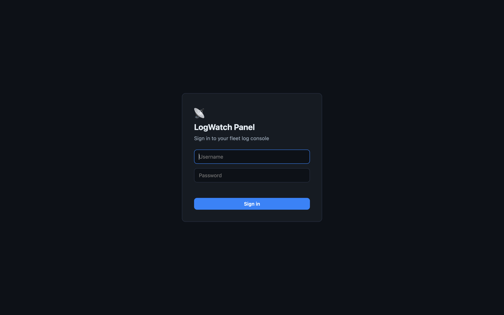
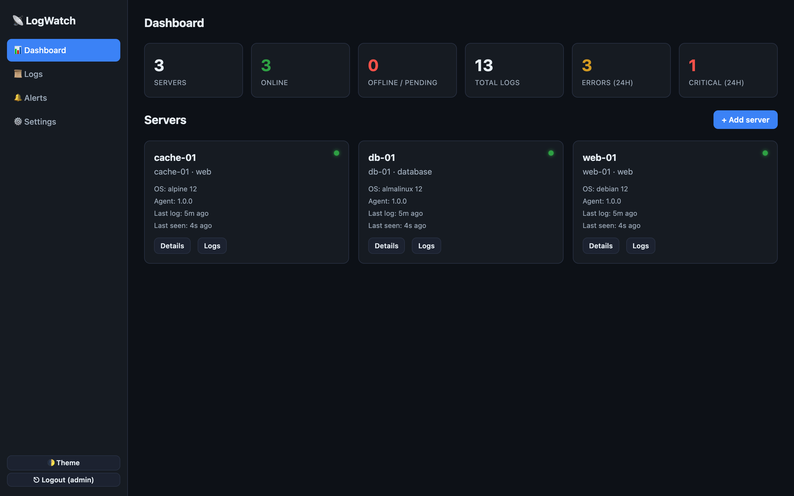
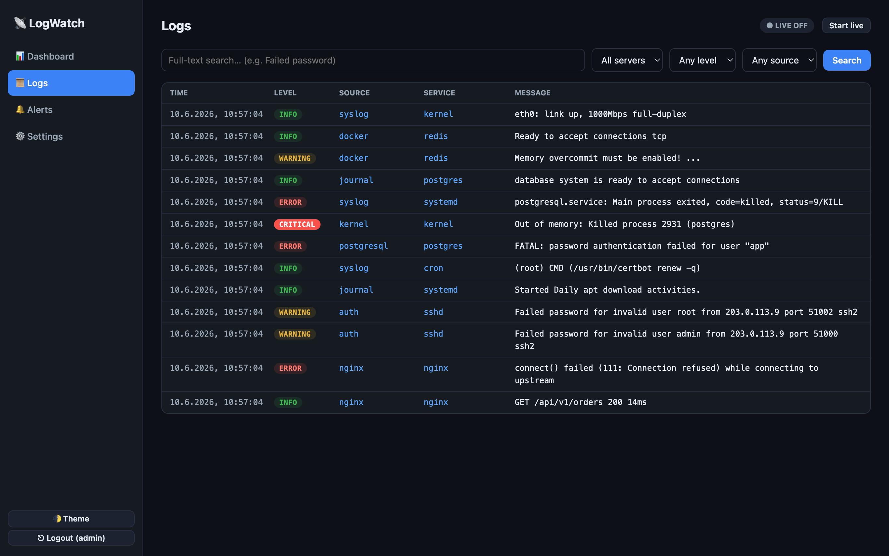
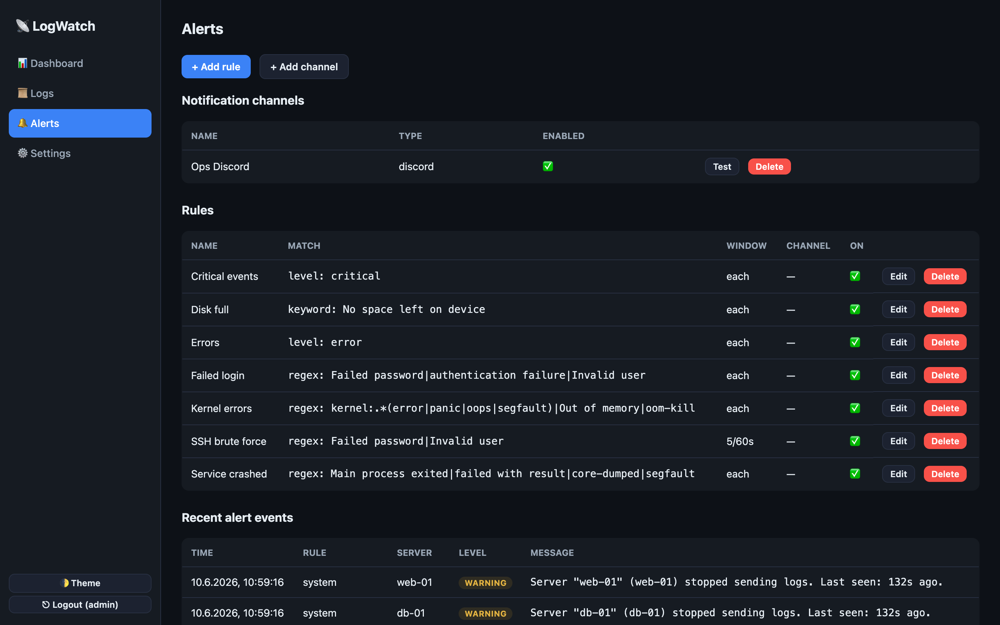

<div align="center">

# 📡 LogWatch Panel

**Centralized log collection, live search and alerting for your whole Linux fleet.**

A self-hosted panel + a tiny Go agent. Install the panel with one command, connect
any Linux server with another. See every log, search across the fleet, and get
pushed a Discord/Gotify/Telegram/email alert the moment something breaks.

[](https://github.com/Fabio-Kumahost/logwatch-panel/actions/workflows/ci.yml)
[](https://github.com/Fabio-Kumahost/logwatch-panel/releases)
[](LICENSE)


[Features](#features) · [Quick start](#quick-start) · [Docker](#run-with-docker) · [Connect a server](#connect-a-server) · [Architecture](#architecture) · [Docs](#documentation)

</div>

---

## Screenshots

| Login | Dashboard |
|-------|-----------|
|  |  |

| Live logs & search | Alert rules |
|--------------------|-------------|
|  |  |

---

## Features

**Panel**
- 🔐 Login with admin account, **bcrypt** hashing, login rate-limiting, JWT sessions
- 📊 Dashboard: every server with **online / offline / pending** status, last log time
- 📜 Search across **all** logs (SQLite **FTS5** full-text) with filters: server, level, source, service, time range
- ⚡ **Live log stream** over WebSocket (SSE fallback)
- 🗄️ Historical storage with **configurable retention**
- 👥 Roles (admin / operator / viewer), **API-key (token) management** per server
- 🔒 **Two-factor authentication (TOTP)** + **security audit log** (CSV export)
- 📈 **Dashboard charts** (24h volume + level breakdown), **CSV log export**
- 📊 **Prometheus `/metrics`** endpoint, **one-click self-update**
- 🌓 **Dark mode** (default) + light, fully **responsive**

**Agent** (single static Go binary, ~6 MB, low CPU/RAM)
- Runs as a hardened **systemd** service (OpenRC on Alpine)
- **Auto-discovers** every available log source — missing files never cause errors
- Tails files with **logrotation/truncation detection**, reads the **systemd journal**, and **Docker** container logs
- **Buffers locally** when the panel is unreachable and **replays** on reconnect
- Self-registers with a token, ships over **HTTPS**, has **update** and **uninstall** built into the installer

**Alerting**
- Channels: **Discord**, **Gotify**, **Telegram**, **SMTP** (email)
- Rule UI: keyword / regex / log-level match, source & server-group filters,
  **frequency window + threshold**, **cooldown** anti-spam, target channel
- Ships with sensible defaults: errors, critical, failed login, **SSH brute force**,
  kernel errors, service crashed, disk full — plus **agent offline / no logs**

## Collected log sources

systemd journal · `/var/log/syslog` · `/var/log/messages` · `auth.log` · `secure` ·
`kern.log` · `dmesg` · `nginx/*.log` · `apache2/*.log` · `httpd/*.log` ·
`mysql`/`mariadb`/`postgresql` logs · Docker/container logs · cron · mail ·
SSH/auth · kernel · and any app logs under `/var/log/**/*.log`. Sources are
detected automatically per distribution.

## Supported distributions

Debian · Ubuntu · Proxmox · TrueNAS SCALE* · AlmaLinux · Rocky Linux · CentOS ·
Fedora · Arch Linux · openSUSE · Alpine Linux

<sub>*TrueNAS SCALE is Debian-based; the agent runs but its root filesystem is managed, so install into a persistent dataset.</sub>

---

## Quick start

> **This repository is private.** GitHub's `raw.githubusercontent.com` and `git clone`
> require authentication for private repos, so the bare one-liner below returns 404
> until you either make the repo public **or** pass a GitHub read token (next section).

Install the panel on a Debian/Ubuntu VPS (other distros are auto-detected too):

```bash
# Works once the repository is PUBLIC:
bash <(curl -sSL https://raw.githubusercontent.com/Fabio-Kumahost/logwatch-panel/main/install.sh)
```

### Installing from a private repo (with a token)
Create a GitHub token with read access to this repo, then:
```bash
curl -fsSL -H "Authorization: token $GH_TOKEN" \
  https://raw.githubusercontent.com/Fabio-Kumahost/logwatch-panel/main/install.sh \
  | sudo LW_GH_TOKEN="$GH_TOKEN" bash
```
The token is used only to clone the repo and is never written to disk (the stored
git remote is rewritten without it). The **agent** one-liner is unaffected by repo
visibility — it is served by your panel over its own HTTPS, not from GitHub.

The installer will:
1. Detect your OS and install dependencies (Node.js 20, Nginx, build tools)
2. Install the panel to `/opt/logwatch-panel`
3. Initialize the SQLite database and create your **admin account**
4. Create and start a **systemd** service
5. Set up an **Nginx** reverse proxy (optionally on your domain)
6. Optionally obtain a **Let's Encrypt** certificate via certbot
7. Print firewall hints and your **login URL, username and password**

### Non-interactive install
```bash
LW_NONINTERACTIVE=1 LW_DOMAIN=panel.example.com LW_SSL=y LW_SSL_EMAIL=me@example.com \
LW_ADMIN_USER=admin LW_ADMIN_PASS='ChangeMe123!' \
bash <(curl -sSL https://raw.githubusercontent.com/Fabio-Kumahost/logwatch-panel/main/install.sh)
```

## Run with Docker

```bash
git clone https://github.com/Fabio-Kumahost/logwatch-panel.git
cd logwatch-panel
cp .env.example .env       # set JWT_SECRET (openssl rand -hex 48) and ADMIN_PASS
docker compose up -d --build
# → http://localhost:8088
```

The database persists in the `logwatch-data` volume. Put your own reverse proxy /
TLS in front for production, and set `PUBLIC_URL` so agent install one-liners use
the right address.

## Connect a server

In the panel click **Add server** — you get a one-liner with a unique token:

```bash
curl -sSL https://panel.example.com/agent/install.sh | sudo bash -s -- \
  --panel https://panel.example.com --token <SERVER_TOKEN>
```

The agent installer detects the OS, installs the right binary, writes its config,
creates a systemd/OpenRC service, starts it and tests connectivity.

**Self-signed panel?** add `--insecure`. **Need all root-only logs?** add `--run-as-root`.

**Update the agent:** re-run the one-liner. **Remove it:**
```bash
curl -sSL https://panel.example.com/agent/install.sh | sudo bash -s -- --uninstall
```

---

## Architecture

```
                       ┌──────────────────────────────────────────┐
                       │              LogWatch Panel              │
   ┌─────────┐  HTTPS  │  Fastify API  ·  WebSocket/SSE stream     │
   │ Agent 1 │ ───────▶│  SQLite (+FTS5)  ·  Alert engine         │──► Discord
   ├─────────┤  Bearer │  bcrypt/JWT auth ·  Retention/Heartbeat   │──► Gotify
   │ Agent 2 │ ───────▶│  Static SPA (dark, responsive)           │──► Telegram
   ├─────────┤         └──────────────────────────────────────────┘──► SMTP
   │ Agent N │              ▲ Nginx reverse proxy + Let's Encrypt
   └─────────┘              │ systemd service on the VPS
```

- **Backend**: Node.js + Fastify, SQLite (better-sqlite3) with FTS5 full-text search
- **Frontend**: dependency-free vanilla SPA (HTML/CSS/JS), dark mode, responsive
- **Agent**: Go, standard library only, single static binary per architecture
- **Process mgmt**: systemd (OpenRC on Alpine) · **Proxy**: Nginx · **SSL**: certbot

## Repository layout

```
.
├── install.sh                 # panel installer (the one-liner target)
├── Makefile                   # build agent binaries
├── panel/                     # Node.js panel (API + SPA)
│   ├── src/                   #   server, routes, services, db, auth
│   ├── public/                #   vanilla SPA
│   └── tests/smoke.test.js    #   end-to-end smoke tests
├── agent/                     # Go agent (stdlib only)
│   ├── main.go
│   └── internal/{config,collector,buffer,sender,discovery,...}
├── agent-bin/                 # prebuilt agent binaries (served by the panel)
├── scripts/                   # agent-install.sh, update.sh, uninstall.sh
├── deploy/{systemd,nginx}/    # service units + nginx template
├── docs/                      # API.md, examples (discord, gotify)
└── .github/workflows/         # CI (tests + cross-compile) and release
```

## Development

```bash
# Panel
cd panel && npm install && npm test          # run the smoke suite
DB_PATH=./data/dev.db ADMIN_USER=admin ADMIN_PASS='dev12345' node src/db/migrate.js --seed-admin
PUBLIC_URL=http://localhost:8088 npm start    # http://localhost:8088

# Agent (requires Go ≥ 1.21)
make agent-all                                # cross-compile into agent-bin/
go -C agent vet ./...
```

## Documentation

- **[API reference](docs/API.md)** — every endpoint, auth schemes, payloads
- **[Security concept](SECURITY.md)** — threat model and controls
- **[Discord example](docs/examples/discord.md)** · **[Gotify example](docs/examples/gotify.md)**

## License

[MIT](LICENSE) © 2026 Fabio Agostinho
